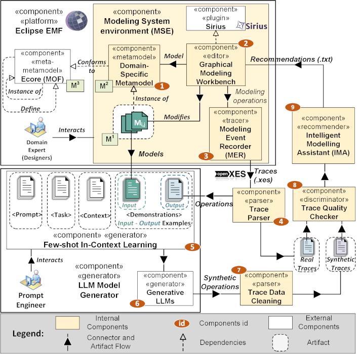

# ***MASTER-LLM***: a conceptual framework to support ***M***odeling ***A***ssistants using ***S***ynthetic ***T***race g***E***neration of modeling ope***R***ations through ***LLM***

This repository presents our proposed approach and the corresponding replication package. The core concept involves integrating a Modeling Event Recorder (MER) framework within a Modeling System Environment (MSE). This framework captures and traces designer activities and modeling steps. Subsequently, it injects these events into Intelligent Modeling Assistants (IMAs), enabling the generation of personalized suggestions for modeling actions most relevant to each designer. The integration path is shown in the Figure below.

The repository is organized as follows:

1. **01-02-03 MSE** contains two sub-folders:
    - **MSE_HEPSYCODE**: This folder contains the HEPSYCODE Graphical Modeling Workbench and the Modeling Event Recorder (MER);
    - **MSE_CAEX**: This folder contains the CAEX Graphical Modeling Workbench and the Modeling Event Recorder (MER);
4. **04 Trace Parser**: This folder contains the results of parsing the MER tracing files for each MSE;
5. **05-06-07 LLM Synthetic Dataset**: This folder contains one sub-folder for trace generation as follows:
    - **D2 Trace Synthetic Dataset**: This contains the prompt schemas used and the results of the queries made to the considered LLMs for each MSE (e.g., CAEX and HEPSYCODE);
6. **08 Trace Quality Checker**: This folder contains the Python code for extracting metrics related to the correctness, diversity, and hallucination of synthetic traces, along with the corresponding Jamovi projects for statistical analyses in the results_RQ1 folder for each MSE;
8. **09 IMA**: This folder contains MORGAN, the recommender system used in this work, with two folders containing the results related to RQ2 and RQ3 for each MSE.
